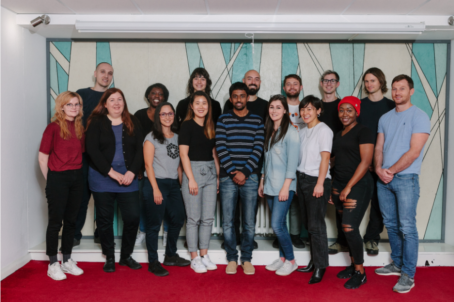

# :sparkles: FAC15 
[Founders & Coders](https://foundersandcoders.com/) programme offers 16-week full-stack JavaScript course for 16 students. It is peer-led and project-based working in 4 teams. To apply to the programme, I needed to complete [course prerequisites](https://foundersandcoders.com/apply/prerequisites/) first. Afterwards, I invited to interview and offered places. The course for cohort 15 started on 29 October and will end 22 February 2019.

:heavy_check_mark: My first [Portfolio](https://whooolia.github.io/First-Portfolio/) builted as part of application 
:heavy_check_mark: [Calculate](https://whooolia.github.io/Calculator/) builted as part of pre-course
  

      
# :pencil2: Learning
Each week introduces a new topic

|  WEEK &nbsp;&nbsp;&nbsp;&nbsp;&nbsp; |  ACTIVITIY &nbsp;&nbsp;&nbsp;&nbsp;&nbsp; |  WEEK   |  ACTIVITIY&nbsp;&nbsp;&nbsp;&nbsp;&nbsp;  |
| --------- | ----------- | --------- | ----------- |
|  [week 1](#week-1--github)  | Toolkit   |  week 6(#week-6--databases)  | PostgreSQL |
|  [week 2](#week-2--testing)  | Testing   |  week 7  | Authentication |
|  [week 3](#week-3--apis)  |  APIs     |  week 8   |Express  |
|  [week 4](#week-4--nodejs-server-making-front-end-api-requests)  | Node.js 1/2 | weeks 10-12  | self-selected project |
|  [week 5](#week-5--nodejs-server-making-back-end-api-requests)  | Node.js 2/2 |    |      |

Every day has a mixed of learning coding and soft-skills.

| DAY  | ACTIVITIY |
| ------------- | ------------- |
|  Monday  | Workshops, Client workshops   |
|  Tuesday  | Workshops, Research   |
|  Wednesday  |  Workshops, Team project, Guest speaker    | 
|  Thursday | Team project |
|  Friday  | Code review, Team project presentations, Stop-Go-Continue (SGC), Guest speaker |

--- 

# WEEK 1 : Github 
:gem: **What We Learn**
- Semantic HTML, Accessibility,CSS - BEM, Mobile-First, Responsive Web Design, Gitflow and use of github, Pair programming, Command Line, Regular Expressions
 
:seedling: **Personal Stretch Goal**
- CSS - Make a navbar
- CSS - Learn how to use grid
- JS - Make a validator to check the valid form

:bulb: **Team Project : Be familiar with Git & Github** :octocat:
- [Team Project](https://fac-15.github.io/CC/) : Make a one page responsive website 
- A [GitHub repo](https://github.com/fac-15/CC_toDoList) ready for code review   

---

# WEEK 2 : Testing
:gem: **What We Learn**
- The Test-driven Development(TDD), Unit & Integration tests, Recatoring, Tape, Callback function, Array methods, IIFE, DOM manipulation

:seedling: **Personal Stretch Goal**
- Be familiar with Array method

:bulb: **Team Project : Unit testing and TDD for client-side code**
- [Team Project](https://fac-15.github.io/CC_toDoList/) : To do list app(learning TDD rather than building an app) :ballot_box_with_check:
- A [GitHub repo](https://github.com/fac-15/CC) ready for code review   

---

# WEEK 3 : APIs
:gem: **What We Learn**
- Flexbox, API, XMLHttp requests, XHR, JSON, Software Architecture

:seedling: **Personal Stretch Goal**

:bulb: **Team Project : A simple web app includes two APIs and use the results to update the DOM**
- Team Project : Using movie, recipe and Giphy API :movie_camera: :hamburger:
- A [GitHub repo](https://github.com/fac-15/hungryish-app/tree/staging) ready for code review    

---

# WEEK 4 : Node.js server making front-end API requests
:gem: **What We Learn**
- Learn how to use Node.js, Node server basics, Module design pattern and server file structure, Back-end testing, Basic ES6 syntax, heroku

:seedling: **Personal Stretch Goal**

:bulb: **Team Project : Autocomplete website/widget**
- Team Project : Find your favortie beers! :beer:
- A [GitHub repo](https://github.com/fac-15/DRINKIO) ready for code review    

---

# WEEK 5 : Node.js server making back-end API requests
:gem: **What We Learn**
- API calls from the back-end using the Request module, Test the routes of your server using Supertest, Continuous integration with Travis, Read and Write Streams in Node, Buffers in Node, How to deploy projects on Heroku 

:seedling: **Personal Stretch Goal** 

:bulb: **Team Project : CoTech Hackathon - Build a component for the CoTech website**
- [Team Project](https://safe-temple-44463.herokuapp.com/) : API calls from the back-end and testing the server using Supertest
:no_good: Unfortunatley, it was an temporary API for just Hackathon, so that its no longer bring any data.
- A [GitHub repo](https://github.com/fac-15/RankMyRequest) ready for code review   

---

# WEEK 6 : Databases
:gem: **What We Learn**
- 

:seedling: **Personal Stretch Goal** 

:bulb: **Team Project : Build a guidebook to Finsbury park**
- [Team Project](https://safe-temple-44463.herokuapp.com/) : A website storing data on a Heroku-hosted database
- A [GitHub repo](https://github.com/fac-15/FAC_guidebook) ready for code review   

